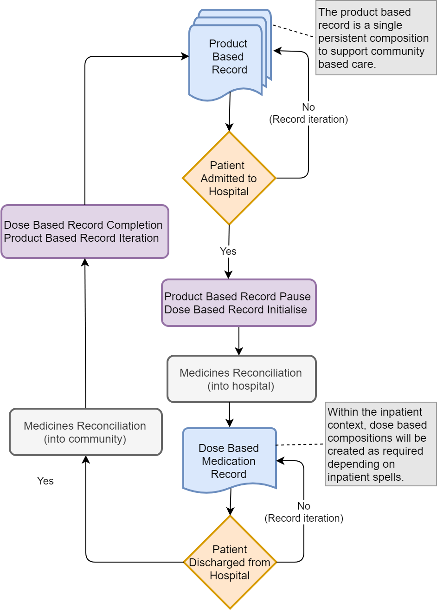
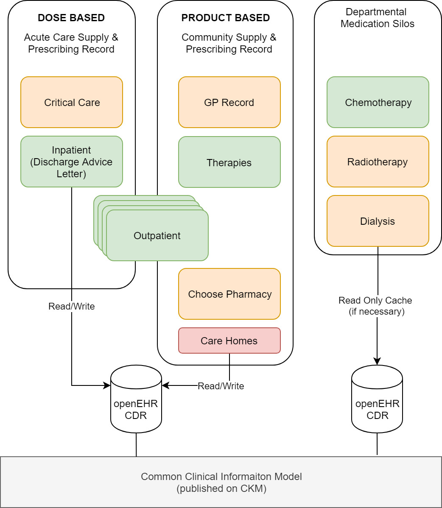

# Model Overview
Here lie the clinical models to describe the Shared Medicines Record. We're using [openEHR](http://www.openehr.org "openEHR") archetypes and templates.

This model is predicated upon several core principles of clincial interaction with a medications list. It may apply to a variety of clinical contexts and there may be subtle differences with how the record is used. 

## Definitions
Medication records principally fall into two categories; dose based for acute care (e.g. inpatient or critical care) and product based where prescriptions are dispensed in community settings (e.g. GP, therapies, advanced treatments, care homes). Hospital outpatient clinics may be a hybrid of both models and therefore the SMA needs to be flexible enough to support both. In addition, several departmental based medicine silos will be incorporated with a read only view. 

Clinical areas such as radiotherapy, chemotherapy, dialysis and child health are important sources of medication data, but not within scope to support a full read/write capability. Over time these systems may be incorporated more fully within the SMA architecture. To support medicines reconciliation in hospital, a read only view of the GP medications record will be created within the SMR.

This repository will support use cases from primary, secondary and tertiary care sectors with read/write capabilities via standards-based APIs.

## The Process
The following diagram describes the process for sharing medicines within the community and acute clinical settings. 

## Proposed Architecture
The design would rely on openEHR clinical models to represent either Dose or Product based records as the two primary approaches to medication and treatment prescribing. It is to be used as a record of active and historical medications in a patient centric view. The repository will support and underpin the data flows required for ePrescribing by utilising models and components that are currently provisioned for use in commercial systems, available as openEHR templates. This demonstrates a robustness and scalability to underpin SMR for both the information model and the technical implementation.

An enterprise grade openEHR clinical data repository will support the SMR providing native REST based APIs for CRUD operations. Interoperability will be facilitated through conformance to the following UK Core NHS FHIR profiles;

* AllergyIntolerance
* Medication
* MedicationReques
* MedicationStatement

Two principle views on the SMR will be made available;

* Acute Care Supply & Prescribing Record
* Community Supply & Prescribing Record